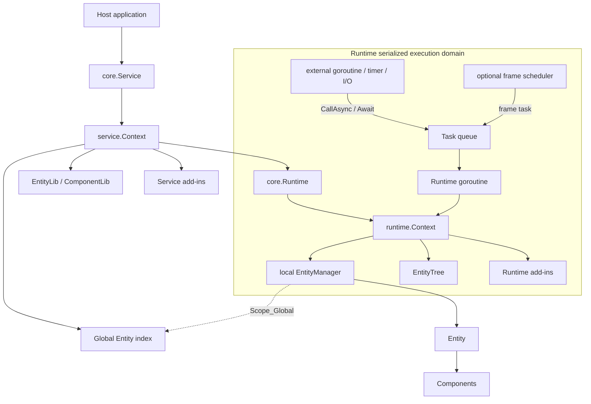
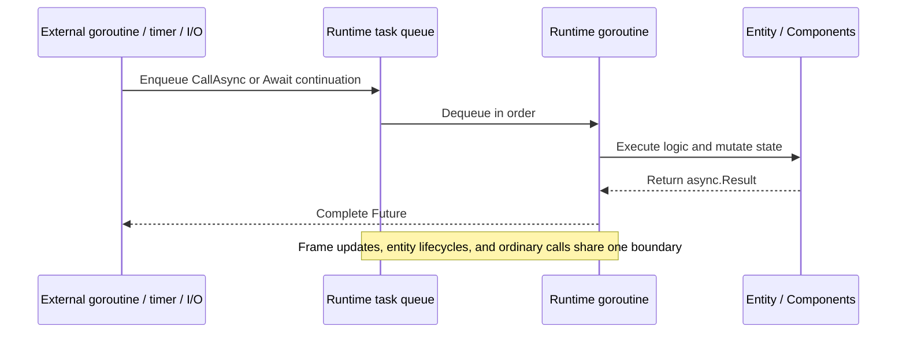

# Golaxy Core

**English** | [简体中文](./README.zh_CN.md)

Golaxy Core is the execution kernel and programming-model foundation of the [Golaxy Distributed Service Development Framework](https://github.com/pangdogs/framework). It hosts EC (Entity-Component) business objects inside Actor-style serialized Runtime domains and provides lifecycles, prototypes, entity trees, in-process events, add-ins, and Future/Await primitives.

> **Core determines how business code executes and who owns state. Framework connects that execution model to configuration, logging, RPC, Gate, GAP/GTP, NATS, ETCD, databases, and other production infrastructure.**

## Contents

- [Positioning](#positioning)
- [Key capabilities](#key-capabilities)
- [Architecture](#architecture)
- [Actor + EC execution model](#actor--ec-execution-model)
- [Lifecycles](#lifecycles)
- [Runtime scheduling and frame loop](#runtime-scheduling-and-frame-loop)
- [Entities, components, and prototypes](#entities-components-and-prototypes)
- [Async programming](#async-programming)
- [Events and code generation](#events-and-code-generation)
- [Add-in system](#add-in-system)
- [Context, errors, and shutdown](#context-errors-and-shutdown)
- [Requirements and installation](#requirements-and-installation)
- [Quick start](#quick-start)
- [Default behavior reference](#default-behavior-reference)
- [Project layout](#project-layout)
- [Development and verification](#development-and-verification)
- [Ecosystem and license](#ecosystem-and-license)

## Positioning

Core is a stateful business execution kernel that can be embedded independently in a Go process. It is also a direct code dependency of the higher-level Framework. The three layers have distinct responsibilities:

| Layer | Primary responsibility | Typical contents |
| --- | --- | --- |
| Golaxy Core | In-process execution, state ownership, and business-object lifecycles | Service, Runtime, Entity, Component, Prototype, Event, Future, Add-in |
| Golaxy Framework | Distributed service assembly and infrastructure integration | Application bootstrap, configuration, logging, RPC, Gate, GAP/GTP, NATS, ETCD, databases |
| Scaffold / application | Product services and deployment structure | Player, battle, scene, friend, mail, guild, and operations modules |

Core itself does not provide network listeners, RPC transport, service discovery, message brokers, database drivers, or a configuration center. Use Framework above Core when those features are required, or implement custom add-ins to integrate external systems.

### Good fits

- Stateful game-server objects such as players, rooms, battles, scenes, NPCs, and guilds.
- Simulation, remote-control, digital-twin, and real-time collaboration systems that need stable identities and ordered execution.
- Backends that decompose complex objects into composable components while strictly controlling where concurrent writes happen.
- Long-running processes that need both event-driven tasks and fixed-rate frame updates.

### What it is not

- **Not one goroutine per Entity**: a Runtime manages a group of entities that share one serialized task queue.
- **Not a conventional data-oriented ECS**: Core EC centers on object lifecycles and component composition rather than global System queries and batch processing.
- **Not a durable Actor system**: Core does not provide message journaling, crash recovery, cross-process mailboxes, or automatic state persistence.
- **Not a general HTTP/CRUD framework**: ordinary stateless requests are often simpler with standard HTTP tools; Core is most useful for long-lived business state that requires ordered updates.

## Key capabilities

- **Service scope**: manages the parent Context, shutdown barrier, prototype libraries, global entity index, and service add-ins.
- **Actor-style Runtime**: serializes tasks, entity lifecycles, and optional frame updates on one running goroutine; synchronous events emitted during that work run on the same goroutine.
- **EC business model**: Entity supplies identity, scope, and lifecycle; Component supplies composable behavior and state.
- **Prototype system**: declares entity types, default scope, metadata, and built-in component compositions before constructing instances.
- **Entity tree**: maintains parent-child relationships within one Runtime, with attach, detach, move, post-order removal, and ordered traversal.
- **Async coordination**: provides Runtime scheduling, background goroutines, timers, Channel-to-Future bridges, and `Any`, `OK`, `All`, `Transform`, and `Foreach` Await strategies.
- **Synchronous events**: offers an in-process signal/slot system with priorities, recursion policies, managed unbinding, and code generation.
- **Add-in extension**: distinguishes fixed-startup Service add-ins from hot-pluggable Runtime add-ins.
- **Lifecycle and statistics**: drives Service, Runtime, Entity, Component, and Add-in lifecycles and exposes wait-group, task-queue, and frame statistics.

## Architecture



### Core objects

| Object | Responsibility | Concurrency model |
| --- | --- | --- |
| `core.Service` | Drives service startup, heartbeat, shutdown, and Service add-in lifecycles. | Its worker loop runs in a dedicated goroutine. |
| `service.Context` | Holds service resources, prototype libraries, the global entity index, and the shutdown barrier. | Individual capabilities have specific rules; the global entity index is concurrency-safe. |
| `core.Runtime` | Drives the task queue, frame loop, GC, entities, and Runtime add-ins. | One Runtime owns one serialized running goroutine. |
| `runtime.Context` | Exposes Runtime-local objects and current execution capabilities. | Direct local-state access is restricted to the owning Runtime goroutine. |
| `runtime.ConcurrentContext` | Exposes a Runtime subset usable from other goroutines. | Cross-goroutine work returns through `CallAsync`. |
| `ec.Entity` | A business object with an ID, scope, metadata, component collection, and tree-node state. | Ordinary methods belong to the Runtime serialization domain. |
| `ec.ConcurrentEntity` | Exposes ID, prototype, Context, and termination state through a concurrent view. | Safe to read across goroutines; mutation must still return to the Runtime. |
| `ec.Component` | A unit of business behavior or state attached to an Entity. | Lifecycle and state mutation belong to the Runtime serialization domain. |

## Actor + EC execution model

### Runtime is the Actor boundary

The Actor boundary in Core is the `Runtime`, not an individual Entity. A Runtime owns one task queue, one local entity manager, one entity tree, and zero or more entities. They all share the same serialized execution domain.



This has several direct consequences:

- Ordinary tasks, lifecycle callbacks, and frame callbacks do not run concurrently inside one Runtime, so their business state normally needs no locks.
- Placing multiple entities in one Runtime gives them a shared order of execution and a shared single-thread throughput limit.
- Entities do not create goroutines automatically, and there is no independent mailbox per Entity.
- Code outside the Runtime must not directly mutate entities, components, the entity tree, or Runtime add-ins. Use `CallAsync`, `CallVoidAsync`, or an entity-ID call.
- `GoAsync` is suitable for blocking I/O and independent computation, but its background function must not touch Runtime-local state directly. Use `Await` to schedule result handling back onto the Runtime.

### Local and global Entity addressing

Every Entity exists in the local `EntityManager` of its owning Runtime:

- `Scope_Local`: the Entity is visible only through the local Runtime index.
- `Scope_Global`: the Entity is also registered in the concurrency-safe Service-level index.
- `service.Context.CallAsync(entityId, ...)` resolves a `ConcurrentEntity` from the global index, then enqueues the call onto the target Runtime.
- “Global” in Core means addressable across runtimes within the same Service process. Cross-node addressing belongs to Framework distributed-entity and RPC capabilities.

## Lifecycles

### Service lifecycle

`core.NewService` emits `Birth` synchronously while binding a `service.Context`. Calling `Run` starts the worker loop:

`Birth → Starting → Started → Heartbeat* → Terminating → Terminated`

| Stage | Key behavior |
| --- | --- |
| `Birth` | The Service exists; declare prototypes, install Service add-ins, or prepare startup resources here. |
| `Starting` | Starts prototype watchers, freezes the Service add-in manager, and initializes add-ins in installation order. |
| `Started` | The Service is running; runtimes are commonly created here. |
| `Heartbeat` | Emits once per second. |
| `Terminating` | The Context is canceled; closes the wait-group entry point and waits for runtimes and other children. |
| `Terminated` | Service add-ins have shut down in reverse order and the termination Future completes. |

A Service can run only once, and a `service.Context` can be bound to only one `core.Service`.

### Runtime lifecycle

`core.NewRuntime` emits `Birth` synchronously while binding a `runtime.Context`. `AutoRun` defaults to `false`; when enabled, `Run` is called after all `Birth` handlers finish.

`Birth → Starting → Started → Tasks / Frames / GC → Terminating → Terminated`

| Stage | Key behavior |
| --- | --- |
| `Birth` | The Runtime object and task queue exist; pre-start Runtime add-ins may be installed. |
| `Starting` | Activates installed Runtime add-ins and connects EntityManager lifecycle events. |
| `Started` | Entities can be created and activated. Entities added before startup are activated here as well. |
| Running | Serially handles calls, frame tasks, and entity lifecycles, and periodically runs Runtime GC. |
| `Terminating` | The Context is canceled and the task queue has been closed and drained; entities are then destroyed in reverse order. |
| `Terminated` | The wait group is empty, Runtime add-ins are stopped, managed event handles are unbound, and the termination Future completes. |

A `runtime.Context` can be bound to only one `core.Runtime`, and a Runtime can run only once.

### Entity and Component lifecycles

The one-way Entity state chain is:

`Born → Entered → Awakened → Starting → Alive → Leaving → Shutting → Dead → Destroyed`

The primary Component state chain is:

`Born → Attached → Awakened → Enabling → Starting → Alive → Detaching → Shutting → Disabling → Dead → Destroyed`

A disabled Component enters `Idle`. Enabling it again invokes `OnEnable` and returns it to `Alive`, but `Start` is not repeated.

| Object | Activation callbacks | Frame callbacks | Deactivation callbacks |
| --- | --- | --- | --- |
| Entity | `Awake()` → `Start()` | `Update()` → `LateUpdate()` | `Shut()` → `Dispose()` |
| Component | `Awake()` → `OnEnable()` → `Start()` | `Update()` → `LateUpdate()` | `Shut()` → `OnDisable()` → `Dispose()` |

Important ordering rules:

1. Entity `Awake` runs before the `Awake` callbacks of its built-in components.
2. Component `Awake`, `OnEnable`, and `Start` run as separate phases; each phase traverses components in insertion order, followed by Entity `Start`.
3. During destruction, Entity `Shut` runs first; components run `Shut`, `OnDisable`, and `Dispose` in reverse insertion order; Entity `Dispose` runs last.
4. `Awake`, `Start`, `Shut`, and `Dispose` run at most once. `OnEnable` and `OnDisable` may repeat as enabled state changes.
5. Adding components dynamically to a running Entity synchronously advances the new component activation flow.
6. Destroying an Entity cancels its Context, removes it from the tree and indexes, and automatically unbinds managed Entity and Component event handles.

## Runtime scheduling and frame loop

### Task queue

Ordinary calls enter the task queue through `runtime.Context.CallAsync`, `CallVoidAsync`, or the equivalent root-package helpers.

- The default queue is **unbounded**. `Capacity=128` matters only after switching to bounded mode.
- A bounded queue uses non-blocking enqueue; a full queue returns `ErrTaskQueueFull` through the Future.
- New tasks return `ErrTaskQueueClosed` after Runtime closes the queue.
- Shutdown drains tasks that were already accepted, then performs a final GC pass.
- `Runtime.Stats()` reports `Enqueued`, `Pending`, `Rejected`, and `Completed` separately for ordinary calls and frame tasks.

An unbounded queue prevents immediate rejection during a transient burst, but a backlog consumes memory and increases latency. Production systems should monitor `Pending` and call latency and apply admission control at external entry points.

### Frame loop

The frame loop is enabled by default at a target of 30 FPS with no frame limit. Disable it to use a Runtime as a purely message-driven Actor:

```go
core.With.Runtime.Frame(
	core.With.Frame.Enabled(false),
)
```

With the frame loop enabled:

- The scheduler puts frame tasks on the same queue, preserving serialization between `Update`, `LateUpdate`, and ordinary calls.
- Each frame emits `FrameLoopBegin` and `FrameUpdateBegin`, runs every `Update` and `LateUpdate`, then emits `FrameUpdateEnd` and `FrameLoopEnd`.
- The scheduler waits for the current frame task to finish, so multiple frames never execute concurrently.
- Blocking tasks or expensive frame callbacks reduce actual FPS. `Frame()` exposes current FPS, frame counts, and recent timings.
- Setting `TotalFrames > 0` automatically terminates the Runtime after that number of frames.

### Runtime GC

Runtime GC runs every 10 seconds by default and once more during shutdown:

- `runtime.Context.CollectGC` collects objects that implement `runtime.GC` and currently return `NeedGC() == true`.
- `With.Runtime.CustomGC` can run application-specific cleanup after built-in cleanup.
- Runtime GC is deferred cleanup for framework objects; it does not replace the Go garbage collector.

## Entities, components, and prototypes

### Prototypes

Prototypes keep reusable construction definitions in the Service scope:

| Object | Purpose |
| --- | --- |
| `ComponentLib` | Registers construction prototypes by fully qualified Go component type; repeated declaration of the same named type reuses the existing object. |
| `EntityLib` | Registers Entity compositions by business prototype name; redeclaring the same name replaces the previous version. |
| `ComponentDescriptor` | Configures a built-in component name, removability, and metadata. |
| `EntityDescriptor` | Configures the Entity instance type, default Scope, first-touch behavior, component-ID policy, and metadata. |
| `BuildEntityPT` | Declares an Entity Prototype through a fluent API. |
| `BuildEntity` | Constructs an Entity from a declared Prototype and adds it to the current Runtime. |

`EntityLib` and `ComponentLib` use read-only snapshots for concurrent queries. Their `Watch` APIs deliver the current snapshot followed by later declarations.

### Entity

- If no persistent ID is supplied, an ID is generated when the Entity enters a Runtime.
- Both Entity and Prototype default to `Scope_Global`.
- `Meta` carries business metadata keyed by strings.
- Event handles stored in `Managed()` are unbound automatically during destruction.
- `Terminated()` completes after the Entity reaches `Destroyed`.
- `Destroy()` is a request; the owning Runtime performs removal and lifecycle advancement.

### Component

- One Entity may contain multiple components with the same name. `GetComponent` returns the first, while `GetComponents` returns all of them.
- Built-in components are not dynamically removable by default. Enable removal with `ComponentDescriptor.SetRemovable(true)`.
- Components added dynamically at runtime are removable by default.
- Components reuse the Entity ID by default. Enable `ComponentUniqueID` to allocate an independent ID for every Component.
- `SetEnabled(false)` unbinds frame updates and invokes `OnDisable`; enabling again invokes `OnEnable`.
- `ComponentAwakeOnFirstTouch` defers component awakening until first access.
- Event handles stored in `Managed()` are unbound automatically during component destruction.

### EntityTree

Every Runtime exposes an EntityTree with a virtual forest root:

- `MakeRoot` attaches a free Entity to the forest root.
- `AddChild`, `DetachNode`, and `MoveNode` manage relationships and prevent cycles.
- `RemoveNode` removes a subtree relationship in post-order but **does not destroy any Entity**.
- Destroying an Entity automatically removes the tree relationships for that Entity and its subtree.
- Child traversal preserves insertion order and supports forward, reverse, filter, and count operations.
- EntityTree is not concurrency-safe and must be used on the owning Runtime goroutine.

## Async programming

### Future

`utils/async` provides `Result`, `Future`, `FutureChan`, and `FutureVoid`:

- `Future.Wait(ctx)` waits for the next result or Context cancellation.
- `Future.Chan()` consumes one or more yielded results.
- `Future.Done()` closes when the producer ends the Future.
- `Future.Context(ctx)` derives a Context that is canceled when the Future completes.
- A Future result channel uses **competing consumption**, not broadcast semantics. Multiple consumers race for the same results.
- A producer must either call `Return` once, or call `YieldReturn` zero or more times followed by one `YieldBreak`.

### Async entry points

| API | Execution location | Purpose |
| --- | --- | --- |
| `CallAsync` / `CallVoidAsync` | Target Runtime goroutine | Safely read or mutate Runtime-local state. |
| `GoAsync` / `GoVoidAsync` | New goroutine | Blocking I/O, independent computation, or work that does not touch Runtime state. |
| `TimeAfterAsync` / `TimeAtAsync` | Internal timer goroutine | One-shot timed result. |
| `TimeTickAsync` | Internal timer goroutine | Continuous ticks until Context cancellation. |
| `ReadChanAsync` | Internal bridge goroutine | Converts Channel values into a stream of Future results. |

### Await

`Await(provider, futures...)` waits in the background but schedules continuations back onto the Runtime that owns `provider`:

| Strategy | Semantics |
| --- | --- |
| `Any` / `AnyVoid` | Uses the first result that becomes available, whether successful or failed. |
| `OK` / `OKVoid` | Uses the first successful result; returns `ErrNoFutureSucceeded` if all fail. |
| `All` / `AllVoid` | Takes one result from each Future and preserves input order. |
| `Transform` | Merges streaming results, transforms each item on the Runtime, and yields transformed results. |
| `Foreach` | Merges streaming results and executes a void callback for each item on the Runtime. |

Avoid a long `Future.Wait` directly on the Runtime goroutine because it blocks the entire serialization domain. The usual pattern is “wait in the background, then return to the Runtime through `Await`.”

## Events and code generation

The `event` package provides in-process synchronous signal/slot events:

- An event dispatches synchronously on the emitter's current goroutine. It does not enter the Runtime queue or cross a process boundary.
- Subscribers run in ascending `priority`; equal priorities preserve binding order.
- `Event`, `Handle`, and `ManagedHandles` are not concurrency-safe. The caller must serialize their use.
- `Handle.Unbind()` precisely removes one binding. Entity, Component, and `runtime.Context` `Managed()` collections can own handles for automatic cleanup.
- Subscriber panic recovery can be enabled, with errors reported non-blockingly through an error channel.
- Recursion policies are `Allow`, `Disallow`, `Discard`, `SkipReceived`, and `ReceiveOnce`. The default recursion-depth limit is 128.

Use `eventc` to generate type-safe bind helpers, handlers, emitters, and event tables:

```go
//go:generate go run git.golaxy.org/core/event/eventc event
//go:generate go run git.golaxy.org/core/event/eventc eventtab --name=myEventTab
```

Typical workflow:

1. Declare event interfaces in a `*_event.go` file.
2. Add the required `go:generate` directives.
3. Use `+event-gen:*` and `+event-tab-gen:*` comments to adjust generation.
4. Run `go generate ./...`.

In-repository references:

- [`ec/component_event.go`](./ec/component_event.go)
- [`ec/entity_event.go`](./ec/entity_event.go)
- [`runtime/context_event.go`](./runtime/context_event.go)
- [`runtime_event.go`](./runtime_event.go)

The repository also contains `stringer` directives. Install `stringer` and ensure `$GOBIN` or `$GOPATH/bin` is on `PATH` before repository-wide generation:

```bash
go install golang.org/x/tools/cmd/stringer@latest
go generate ./...
```

## Add-in system

Add-ins attach cross-cutting capabilities to a Service or Runtime without hard-coding their implementations into Core.

| Property | Service add-in | Runtime add-in |
| --- | --- | --- |
| Installation window | Before Service enters `Starting` | Before startup or while running |
| Manager concurrency | Immutable snapshots support concurrent install, uninstall, and lookup before startup | No concurrency protection; callers must serialize operations, using the Runtime goroutine while running |
| Activation | Initialized in installation order during Service `Starting` | Preinstalled items activate during Runtime `Starting`; runtime installation activates synchronously |
| Uninstall | Application code cannot uninstall after the manager freezes | Can be hot-uninstalled while running |
| Shutdown | Closed in reverse order when Service stops | Deactivated on uninstall or Runtime shutdown |
| Typical use | Shared configuration, logging, database pools, discovery clients | Runtime-local caches, entity helper indexes, frame-related extensions |

An Add-in moves one way through `Loaded → Running → Unloaded`. Lifecycle contracts include:

- General: `LifecycleAddInInit`, `LifecycleAddInShut`
- Service: `LifecycleServiceAddInInit`, `LifecycleServiceAddInShut`
- Runtime: `LifecycleRuntimeAddInInit`, `LifecycleRuntimeAddInShut`
- Runtime event subscription: `LifecycleAddInOnRuntimeRunningEvent`

The `define` package declares type-safe add-in definitions and exposes consistent `Install`, `Uninstall`, `Require`, and `Lookup` operations:

- `Require` returns only an add-in in `Running` state and panics when unavailable.
- `Lookup` requires only that the manager still holds the add-in; it does not guarantee activation.
- The default name is the fully qualified interface or instance type name. Its ID is an FNV-1a hash of that name.

## Context, errors, and shutdown

### Context hierarchy

- A Service Context derives from `context.Background()` by default.
- A Runtime Context derives from its owning Service Context by default.
- An Entity Context derives from its owning Runtime Context.
- Parent cancellation propagates downward, but `Terminated()` completes only after the corresponding object finishes cleanup.

### Shutdown barrier

Service and Runtime contexts both carry a `WaitGroup` barrier:

- `Join(delta)` registers work that must finish before host shutdown.
- Once cleanup begins, the barrier closes and rejects new positive increments.
- `Done()` completes one registered unit.
- `Terminate()` requests cancellation; `Terminated()` means cleanup has actually finished.
- Starting a Runtime automatically joins its parent Service barrier, so Service waits for all runtimes to exit.

### Panic handling

Service and Runtime contexts default to `AutoRecover=false`. With `PanicHandling(true, reportError)`, framework-managed lifecycle, task, and event callbacks attempt to recover panics and write stack-bearing errors non-blockingly to `reportError`.

Recovery prevents the worker loop from failing immediately; it does not make a partially executed business operation transactional. Callbacks should still preserve explicit invariants and be designed for failure.

### Unsafe APIs

`UnsafeContext`, `UnsafeEntity`, `UnsafeRuntime`, and similar entry points exist for internal assembly, generated code, and advanced integrations. They may bypass lifecycle or threading boundaries and are not the preferred APIs for ordinary business code.

## Requirements and installation

- Go version: follow [`go.mod`](./go.mod); the current module targets Go 1.25.
- Module path: `git.golaxy.org/core`
- License: GNU Lesser General Public License v2.1

Install:

```bash
go get git.golaxy.org/core@latest
```

## Quick start

This minimal example creates a Service, declares an Entity Prototype, starts a Runtime without a frame loop, creates an Entity, and cancels the parent Context for an ordered shutdown.

```go
package main

import (
	"context"
	"log"
	"time"

	"git.golaxy.org/core"
	"git.golaxy.org/core/ec"
	"git.golaxy.org/core/runtime"
	"git.golaxy.org/core/service"
)

type PlayerState struct {
	ec.ComponentBehavior
}

func (p *PlayerState) Awake() {
	log.Printf("player %s awake", p.Entity().Id())
}

func main() {
	parent, cancel := context.WithTimeout(context.Background(), 3*time.Second)
	defer cancel()

	svcCtx := service.NewContext(
		service.With.Context(parent),
		service.With.Name("game"),
		service.With.RunningEventCB(func(ctx service.Context, event service.RunningEvent, _ ...any) {
			switch event {
			case service.RunningEvent_Birth:
				core.BuildEntityPT(ctx, "player").
					AddComponent(PlayerState{}).
					Declare()

			case service.RunningEvent_Started:
				core.NewRuntime(
					runtime.NewContext(
						ctx,
						runtime.With.Name("player-runtime"),
						runtime.With.RunningEventCB(func(ctx runtime.Context, event runtime.RunningEvent, _ ...any) {
							if event != runtime.RunningEvent_Started {
								return
							}

							if _, err := core.BuildEntity(ctx, "player").New(); err != nil {
								log.Printf("create player: %v", err)
							}
							cancel()
						}),
					),
					core.With.Runtime.AutoRun(true),
					core.With.Runtime.Frame(core.With.Frame.Enabled(false)),
				)
			}
		}),
	)

	<-core.NewService(svcCtx).Run().Done()
}
```

See [`core_test.go`](./core_test.go) for more scenario-style examples.

## Default behavior reference

| Setting | Default | Notes |
| --- | --- | --- |
| Service parent Context | `context.Background()` | Used when no parent is supplied. |
| Runtime parent Context | Owning Service Context | Service cancellation propagates to Runtime. |
| `AutoRecover` | `false` | Panics propagate by default. |
| Service / Runtime persistent ID | Generated | Uses `uid.Id`. |
| Entity Scope | `Scope_Global` | Enters both the Runtime-local and Service-global indexes. |
| Entity persistent ID | Generated when entering Runtime | May be overridden during construction. |
| Component first-touch awakening | `false` | Components normally awaken during Entity activation. |
| Independent Component IDs | `false` | Components reuse the Entity ID by default. |
| Runtime `AutoRun` | `false` | Call `Run` explicitly or enable AutoRun. |
| Frame loop | Enabled | Target is 30 FPS by default. |
| Frame limit | `0` | Unlimited. |
| Task queue | Unbounded | Bounded mode has a default capacity parameter of 128. |
| Runtime GC interval | 10 seconds | Also runs once during shutdown. |
| Service heartbeat | 1 second | Emits `RunningEvent_Heartbeat`. |
| Event recursion | `Allow` | Maximum depth is 128. |

## Project layout

```text
.
├── define/          # Type-safe add-in definitions
├── ec/              # Entity, Component, state machines, and entity events
│   └── pt/          # Entity / Component prototypes and concurrent libraries
├── event/           # Synchronous events, handles, recursion control, and eventc
├── extension/       # Add-in contracts shared by Service and Runtime
├── runtime/         # Runtime Context, calls, EntityManager, and EntityTree
├── service/         # Service Context, global entity index, and Service add-ins
├── utils/           # async, corectx, generic, iface, meta, uid, and other utilities
├── async.go         # Root-package async entry points
├── await.go         # Await composition strategies
├── runtime*.go      # Runtime loop, frame, task queue, GC, and lifecycles
└── service*.go      # Service loop and lifecycle
```

### Package guide

| Package | Responsibility |
| --- | --- |
| [`/`](./) | Public entry points, Service/Runtime drivers, lifecycle contracts, entity builders, and async helpers. |
| [`/service`](./service) | Service Context, prototype access, global entity index, cross-Runtime entity calls, and Service add-ins. |
| [`/runtime`](./runtime) | Runtime Context, task scheduling, frame statistics, local EntityManager, EntityTree, and Runtime add-ins. |
| [`/ec`](./ec) | Entity/Component model, state machines, component management, scopes, and tree-node events. |
| [`/ec/pt`](./ec/pt) | Entity/Component Prototypes, descriptors, concurrent libraries, and instance construction. |
| [`/event`](./event) | Synchronous events, priorities, recursion policies, Handle, ManagedHandles, and event tables. |
| [`/event/eventc`](./event/eventc) | Type-safe event code generator used through `go:generate`. |
| [`/extension`](./extension) | Common Add-in contracts, states, installation, lookup, and dependency helpers. |
| [`/define`](./define) | Generic Service, Runtime, and common Add-in definitions. |
| [`/utils/async`](./utils/async) | Future, Result, Return, and Yield infrastructure. |
| [`/utils/corectx`](./utils/corectx) | Shared Service/Runtime Context, wait-group, and shutdown protocol. |
| [`/utils`](./utils) | Generic containers, interface caches, metadata, options, type helpers, and UIDs. |

## Development and verification

Regular checks:

```bash
go test ./...
go vet ./...
```

For concurrency-sensitive changes, also run:

```bash
go test -race ./...
```

[`core_stress_test.go`](./core_stress_test.go) uses the `stress` build tag and runs for 120 seconds by default:

```bash
go test -tags stress .
```

Override the stress duration:

```bash
go test -tags stress . -args "-stress.duration=10s"
```

Generate event, event-table, and enum-string code:

```bash
go generate ./...
```

Before committing, confirm that generated `*.gen.go` and `*_string.go` files are up to date, and avoid introducing blocking I/O on a Runtime goroutine.

## Ecosystem and license

- [Golaxy Framework](https://github.com/pangdogs/framework): distributed communication, RPC, Gate, protocol stack, and infrastructure integration built on Core.
- [Golaxy Scaffold](https://github.com/pangdogs/scaffold): game-server project scaffold.
- [Golaxy Examples](https://github.com/pangdogs/examples): end-to-end examples.

This project is licensed under the [GNU Lesser General Public License v2.1](./LICENSE).
