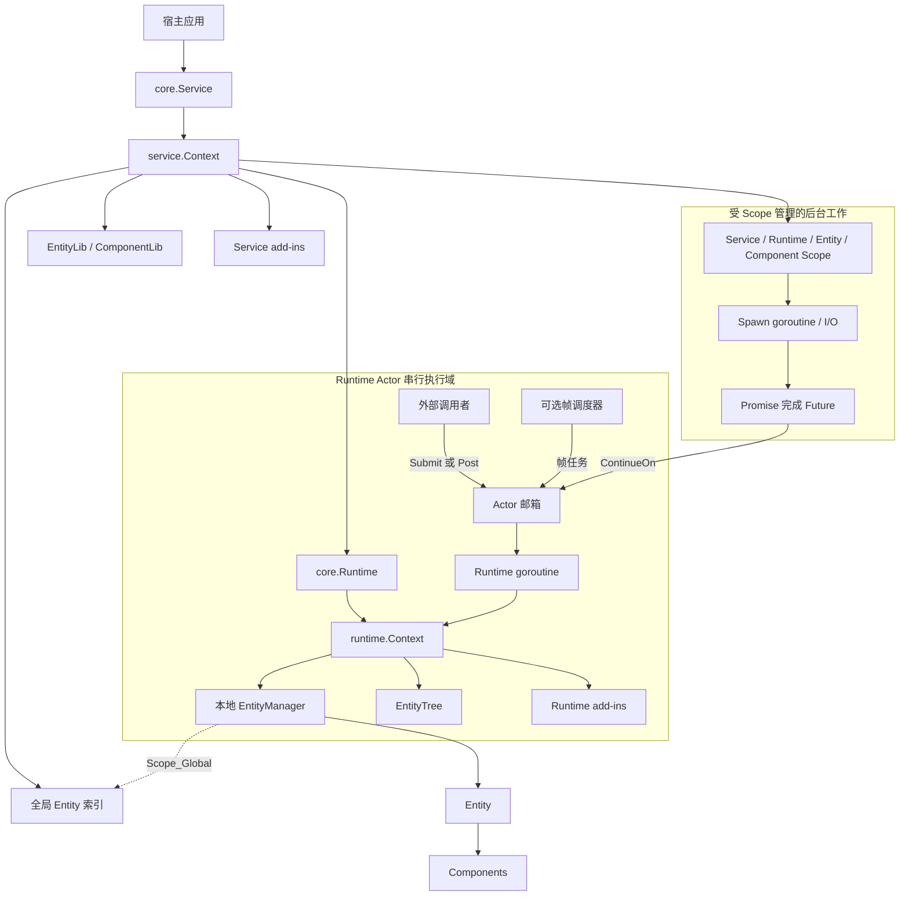
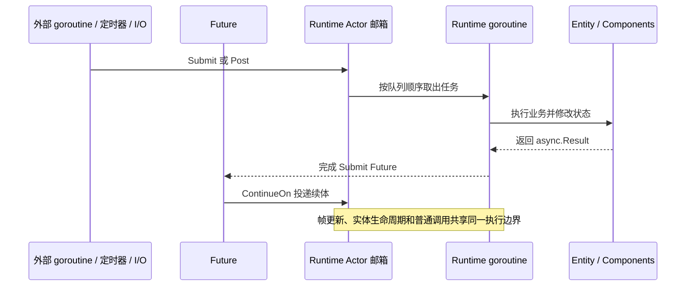
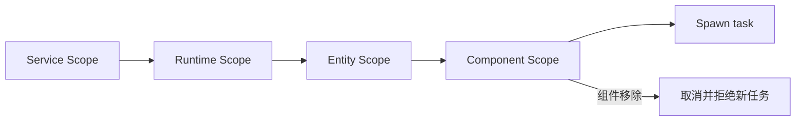

# Golaxy Core

[English](./README.md) | **简体中文**

Golaxy Core 是 [Golaxy 分布式服务开发框架](https://github.com/pangdogs/framework) 的执行内核和编程模型基础。它以 Actor 风格的 Runtime 串行执行域承载 EC（Entity-Component）业务对象，并提供生命周期、原型、实体树、进程内事件、add-in、结构化并发与 Future 续体等基础能力。

> **Core 决定业务代码如何执行、状态由谁拥有；Framework 负责把这套执行模型连接到配置、日志、RPC、Gate、GAP/GTP、NATS、ETCD 和数据库等工程基础设施。**

## 目录

- [项目定位](#项目定位)
- [核心能力](#核心能力)
- [架构](#架构)
- [Actor + EC 执行模型](#actor--ec-执行模型)
- [生命周期](#生命周期)
- [Runtime 调度与帧循环](#runtime-调度与帧循环)
- [Entity、Component 与 Prototype](#entitycomponent-与-prototype)
- [异步编程](#异步编程)
- [事件系统与代码生成](#事件系统与代码生成)
- [Add-in 扩展体系](#add-in-扩展体系)
- [Context、错误处理与关闭](#context错误处理与关闭)
- [环境要求与安装](#环境要求与安装)
- [快速开始](#快速开始)
- [默认行为速查](#默认行为速查)
- [项目结构](#项目结构)
- [开发与验证](#开发与验证)
- [生态与许可证](#生态与许可证)

## 项目定位

Core 是可独立嵌入 Go 进程的状态型业务执行内核，也是上层 Framework 的直接代码依赖。三个层次的职责边界如下：

| 层次 | 主要职责 | 典型内容 |
| --- | --- | --- |
| Golaxy Core | 进程内执行模型、状态所有权和业务对象生命周期 | Service、Runtime、Entity、Component、Prototype、Event、Scope、Future、Add-in |
| Golaxy Framework | 分布式服务装配和基础设施接入 | 应用启动、配置、日志、RPC、Gate、GAP/GTP、NATS、ETCD、数据库 |
| Golaxy Scaffold | 游戏工程脚手架与构建期工具 | Protobuf 的 Go/Godot 代码生成，以及 Excel 配表的 schema、代码和数据处理 |
| 业务项目 | 产品级服务和部署结构 | 通过长连接承载的玩家、房间、战斗、场景等实时业务，以及独立 HTTP 好友、邮件和运营服务 |

Core 本身不提供网络监听、RPC 传输、服务发现、消息代理、数据库驱动或配置中心。需要这些能力时，应在 Core 之上使用 Framework，或者自行实现 add-in 与外部系统集成。

好友、邮件等只是业务项目中常见的 HTTP 服务，不是 Scaffold 内置模块。Scaffold 负责项目起步和构建产物生成，不负责具体产品业务的实现。

### 适合的场景

- 游戏服务端中的玩家、房间、战斗、场景、NPC 和公会等有状态对象。
- 仿真、远程控制、数字孪生和实时协同等需要稳定对象身份与顺序执行的系统。
- 需要把复杂对象拆成可组合组件，同时严格限制并发写入位置的后端服务。
- 希望同时支持事件驱动任务和固定帧更新的常驻进程。

### 不应误解为

- **不是每个 Entity 一个 goroutine 的 Actor 实现**：一个 Runtime 管理一组 Entity，并共享一个串行任务队列。
- **不是传统数据导向 ECS**：Core 的 EC 以对象生命周期和组件组合为中心，不以全局 System 查询和批处理为主要编程方式。
- **不是持久化 Actor 系统**：Core 不负责消息日志、故障恢复、跨进程邮箱或状态自动落库。
- **不是通用 HTTP/CRUD 框架**：纯无状态请求通常直接使用标准 HTTP 框架更简单；Core 更适合承载长期存在且需要顺序更新的业务状态。

## 核心能力

- **Service 作用域**：统一管理父 Context、关闭屏障、实体原型库、全局实体索引和服务级 add-in。
- **Actor 风格 Runtime**：通过单个运行 goroutine 串行执行任务、实体生命周期和可选帧更新；执行期间发出的同步事件也在该 goroutine 中完成。
- **EC 业务模型**：Entity 提供身份、作用域和生命周期，Component 提供可组合行为与状态。
- **Prototype 系统**：预先声明实体类型、默认作用域、元数据和内建组件组合，再按原型构造实例。
- **实体树**：在同一 Runtime 内维护父子关系，支持挂接、分离、移动、后序移除和顺序遍历。
- **异步协作**：用 `Submit` / `Post` 表达 Actor 邮箱投递，用 `Scope` / `Spawn` 管理后台任务生命周期，用 `Future` / `Promise` 表达一次性结果，并用 `ContinueOn` 把续体送回 Runtime。
- **同步事件**：提供带优先级、递归策略、托管解绑和代码生成的进程内 signal/slot 事件系统。
- **Add-in 扩展**：区分固定启动集合的 Service add-in 与可热插拔的 Runtime add-in。
- **生命周期、健康与统计**：统一驱动 Service、Runtime、Entity、Component 和 Add-in，并暴露 Scope、Submit/Post/Frame 队列、等待拒绝与帧统计。

## 架构



### 核心对象

| 对象 | 职责 | 并发属性 |
| --- | --- | --- |
| `core.Service` | 驱动服务启动、心跳、关闭和服务 add-in 生命周期。 | 自身工作循环运行在独立 goroutine。 |
| `service.Context` | 保存服务级资源、原型库、全局实体索引和关闭屏障。 | 具体能力各有约束；全局实体索引可并发访问。 |
| `core.Runtime` | 驱动任务队列、帧循环、GC、实体和运行时 add-in。 | 一个 Runtime 对应一个串行运行 goroutine。 |
| `runtime.Context` | 暴露 Runtime 内部对象和当前执行能力。 | 直接访问局部状态时仅限所属 Runtime goroutine。 |
| `runtime.ConcurrentContext` | 暴露可跨 goroutine 使用的 Runtime 子集。 | 跨 goroutine 通过 `Submit` 或 `Post` 回到运行线程。 |
| `ec.Entity` | 具有 ID、作用域、元数据、组件集合和树节点状态的业务对象。 | 普通方法属于 Runtime 串行域。 |
| `ec.ConcurrentEntity` | 暴露 ID、原型、Context 和终止信号等并发视图。 | 可跨 goroutine 读取；修改仍需调度回 Runtime。 |
| `ec.Component` | 附着在 Entity 上的业务能力或状态单元。 | 生命周期和状态修改属于 Runtime 串行域。 |
| `ec.ConcurrentComponent` | 暴露组件 ID、名称、并发 Runtime Context 和组件 Lifetime Scope。 | 可跨 goroutine 使用；不暴露 `State`、`Enabled`、`Entity` 或 `Destroy`。 |

并发视图存在明确的发布边界：Entity 必须已经成功加入 Runtime；Component 必须随
Entity 完成 Runtime 初始化，或已经动态加入受管 Entity。初始化期间跨 goroutine 访问
属于未定义行为；`AsyncScope()` 返回 `nil` 和 `String()` 返回空字符串只是有限防御，
不能作为原子就绪探针。

## Actor + EC 执行模型

### Runtime 才是 Actor 边界

Core 中的 Actor 边界是 `Runtime`，不是单个 Entity。一个 Runtime 持有一个任务队列、一个本地实体管理器、一棵实体树和零到多个 Entity；这些对象共享同一个串行执行域。



这带来几个直接结论：

- 同一 Runtime 内的普通任务、生命周期回调和帧回调不会彼此并行，通常不需要为这些业务状态加锁。
- 多个 Entity 放入同一 Runtime，意味着它们共享执行顺序，也共享单点吞吐上限。
- Entity 不会自动创建 goroutine，也不存在每个 Entity 独立邮箱。
- Runtime 外部不能直接修改 Entity、Component、EntityTree 或 Runtime add-in；需要结果时使用 `Submit`，只需投递时使用 `Post`，也可以通过 Service 按全局实体 ID 投递。
- 阻塞 I/O 和独立计算应将提供 `AsyncScope()` 的所属对象传给 `Spawn`；后台函数不能直接触碰 Runtime 局部状态，应使用 `ContinueOn` 把结果处理重新投递回来。
- `Submit`、`Post` 和 `ContinueOn` 即使从所属 Runtime 内调用也始终入队，不会内联执行，因此 Actor 的顺序边界保持一致。

### Entity 的本地与全局寻址

每个 Entity 一定存在于所属 Runtime 的本地 `EntityManager` 中：

- `Scope_Local`：只能从所属 Runtime 的本地索引访问。
- `Scope_Global`：除本地索引外，还会注册到 Service 的并发安全全局索引。
- `service.Context.Submit(entityID, ...)` 或 `Post(entityID, ...)` 先从全局索引取得 `ConcurrentEntity`，再把任务投递到目标 Runtime。
- Core 的“全局”只表示同一 Service 进程内跨 Runtime 可寻址；跨节点寻址由上层 Framework 的分布式实体和 RPC 能力负责。

## 生命周期

### Service 生命周期

`core.NewService` 绑定 `service.Context` 时同步发出 `Birth`；调用 `Run` 后进入工作循环：

`Birth → Starting → Started → Heartbeat* → Terminating → Terminated`

| 阶段 | 关键行为 |
| --- | --- |
| `Birth` | Service 已创建，可声明原型、安装 Service add-in 或准备其他启动资源。 |
| `Starting` | 启动原型监听；冻结 Service add-in 管理器，并按安装顺序初始化 add-in。 |
| `Started` | 服务已进入运行状态，通常在这里创建 Runtime。 |
| `Heartbeat` | 每秒触发一次服务心跳事件。 |
| `Terminating` | 父 Context 已取消；关闭等待组入口并等待 Runtime 等子任务退出。 |
| `Terminated` | Service add-in 已按逆序关闭，终止 `Signal` 完成。 |

Service 只能运行一次。同一个 `service.Context` 也只能绑定到一个 `core.Service`。

### Runtime 生命周期

`core.NewRuntime` 绑定 `runtime.Context` 时同步发出 `Birth`。默认 `AutoRun=false`；开启 AutoRun 后，会在 `Birth` 事件处理完成后自动调用 `Run`。

`Birth → Starting → Started → Tasks / Frames / GC → Terminating → Terminated`

| 阶段 | 关键行为 |
| --- | --- |
| `Birth` | Runtime 对象和任务队列已经创建；可安装预启动 Runtime add-in。 |
| `Starting` | 激活已安装 Runtime add-in，并连接 EntityManager 生命周期事件。 |
| `Started` | Runtime 可以创建并激活 Entity。启动前已经加入的 Entity 也会在此阶段激活。 |
| 运行中 | 串行处理普通调用、帧任务和实体生命周期，并按间隔执行 Runtime GC。 |
| `Terminating` | Context 已取消，任务队列已关闭并排空；随后按逆序销毁 Entity。 |
| `Terminated` | 等待组清空、Runtime add-in 停用，托管事件句柄解绑，终止 `Signal` 完成。 |

同一个 `runtime.Context` 只能绑定到一个 `core.Runtime`，Runtime 也只能运行一次。

### Entity 与 Component 生命周期

Entity 的单向状态链为：

`Born → Entered → Awaking → Starting → Alive → Leaving → Shutting → Dead → Destroyed`

Component 的正常启用链为：

`Born → Attached → Awaking → Enabling → Starting → Alive`

Component 的启停分支与运行期单独移除链分别为：

`Enabling / Starting / Alive → Idle → Starting → Alive`

`Detaching → Shutting → Disabling → Dead → Destroyed`

`Attached` 表示 Component 尚未进入 `Awake` 阶段。正常激活会逐个将 Component 从
`Attached` 推进至 `Awaking`；首次访问优先规则可以提前推进被引用的 Component。
`Awaking` 在调用 `Awake` 前开始，并在 Runtime 将 Component 推进至 `Enabling` 时结束。

`Enabling` 是首次启用阶段；从 `Idle` 重新启用时，`OnEnable` 在当前 `Idle` 状态执行，
随后经 `Starting` 回到 `Alive`，但 `Start` 不会重复执行。普通禁用在当前活动状态执行
配对的 `OnDisable` 后进入 `Idle`；`Disabling` 仅用于组件移除或随 Entity 销毁。
单独移除组件时会经过 `Detaching`；随 Entity 销毁时可直接进入 `Shutting`，不会经过
`Detaching`。完整的单独移除链仅在 Entity 处于 `Awaking` 至 `Alive` 时由 Runtime 推进；
其他阶段仍会从组件表移除，但不执行 Runtime 生命周期回调。
尚未进入 `Awaking` 的 Component 不会随 Entity 销毁推进状态，而是继续保持 `Attached`。

| 对象 | 激活回调 | 帧回调 | 停用回调 |
| --- | --- | --- | --- |
| Entity | `Awake()` → `Start()` | `Update()` → `LateUpdate()` | `Shut()` → `Dispose()` |
| Component | `Awake()` → `OnEnable()` → `Start()` | `Update()` → `LateUpdate()` | `Shut()` → `OnDisable()` → `Dispose()` |

重要顺序：

1. 未启用首次访问 `Awake` 顺序时，Entity `Awake` 先于 Component 的 `Awake`。
2. Component 的 `Awake`、`OnEnable` 和 `Start` 保持按加入顺序分阶段执行。`ComponentAwakeOnFirstTouch` 可以使被引用 Component 待执行的 `Awake` 早于正常轮次，但不会提前 `OnEnable` 或 `Start`；Component 阶段结束后 Entity 执行 `Start`。
3. 销毁时 Entity 先执行 `Shut`，随后分别按组件加入顺序的逆序执行全部 Component 的 `Shut`、`OnDisable` 和 `Dispose`，最后 Entity 执行 `Dispose`。
4. `Shut` 只与已经进入的 `Start` 配对，`Dispose` 只与已经进入的 `Awake` 配对；`OnDisable` 与 `OnEnable` 配对，因此未进入相应激活阶段的对象会跳过停用回调。
5. 运行中的 Entity 动态加入 Component 时，Runtime 会同步推进新组件的激活流程。
6. Entity 进入 `Leaving` 后仍可修改组件集合；新增 Component 保持 `Attached`，Runtime 不再推进其激活生命周期。Entity 进入 `Dead` 后组件管理器事件表关闭，新增操作只修改本地组件表。
7. 受管 Entity 和可删除 Component 的 `Destroy()` 会在所属 Runtime goroutine 中同步推进移除；回调内销毁可能在当前回调返回前嵌套执行配对的停用回调。
8. Entity 进入 `Dead` 时先关闭 Entity Scope，之后执行 Component 的禁用与销毁阶段以及 Entity `Dispose`；索引移除完成后进入 `Destroyed` 并兑现 `Terminated()`。
9. Component 进入 `Dead` 时关闭自己的 Lifetime Scope；`SetEnabled(false)` 不会关闭它，因此重新启用后仍可继续使用同一生命周期作用域。

## Runtime 调度与帧循环

### 任务队列

Runtime 邮箱区分三类任务：`Submit`、`Post` 和内部 `Frame`。所有任务都由同一个 Runtime goroutine 串行执行。

- 默认使用**无界队列**；`Capacity=128` 仅在切换为有界队列后生效。
- `Submit` 为任务创建 Future；有界队列已满或队列关闭时，错误写入该 Future。
- `Post` 是无 Future 的 fire-and-forget 路径；只同步返回 `ErrTaskQueueFull`、`ErrTaskQueueClosed` 等入队错误，执行期没有返回值。
- `SubmitDelegate`、`SubmitDelegateVoid` 和 `PostDelegate` 保留 Delegate / DelegateVoid 调用能力。
- `Post` 即使由所属 Runtime 调用也会进入邮箱，因此可用于避免同步重入；它不保证下一帧执行。Core 当前不提供独立的 deferred/next-frame 调度语义。
- 终止时会排空已经接收的任务，然后执行最终 GC。
- `Runtime.Stats().Tasks` 分别提供 `Submit`、`Post`、`Frame` 的 `Accepted`、`Queued`、`Running`、`Completed`、`Canceled`、`Panicked`、`RejectedClosed` 和 `RejectedFull`。
- `Runtime.Stats().Health.LastProgressTime` 记录最近一次任务开始或完成时间；Service 级监控可结合各类别的 `Running` 计数检查长时间无进展的 Runtime。Core 不为每个 Runtime 常驻一个 watchdog goroutine。

无界队列避免生产者因瞬时高峰立即失败，但积压会消耗内存并提高延迟。生产环境应重点监控 `Queued`、`Running`、拒绝计数和 `Health.LastProgressTime`，并在外部入口实施限流。

### 帧循环

帧循环默认开启，目标为 30 FPS，运行帧数不设上限。可以关闭帧循环，把 Runtime 作为纯消息驱动 Actor 使用：

```go
core.With.Runtime.Frame(
	core.With.Frame.Enabled(false),
)
```

启用帧循环时：

- 帧调度器把帧任务加入同一个任务队列，因此 `Update`、`LateUpdate` 和普通调用保持串行。
- 每帧依次发出 `FrameLoopBegin`、`FrameUpdateBegin`，执行全部 `Update` 与 `LateUpdate`，再发出 `FrameUpdateEnd` 和 `FrameLoopEnd`。
- 调度器会等待当前帧任务完成，不会并行执行多个帧。
- 阻塞任务或耗时帧回调会降低实际 FPS；`Frame()` 可读取当前 FPS、帧数和最近耗时。
- `TotalFrames > 0` 时，到达指定帧数会自动终止 Runtime。

### Runtime GC

Runtime 默认每 10 秒执行一次 GC，并在退出前再执行一次：

- `runtime.Context.CollectGC` 收集实现 `runtime.GC` 且当前 `NeedGC()` 的对象。
- 内置清理完成后，可通过 `With.Runtime.CustomGC` 执行自定义清理逻辑。
- 这里的 Runtime GC 是框架对象的延迟清理机制，不替代 Go 垃圾回收器。

## Entity、Component 与 Prototype

### Prototype

Prototype 把可复用的对象构造定义放在 Service 作用域中：

| 对象 | 作用 |
| --- | --- |
| `ComponentLib` | 按组件完整 Go 类型名登记构造原型；同一具名类型重复声明会复用已有对象。 |
| `EntityLib` | 按业务原型名登记 Entity 组合；同名再次声明会替换旧版本。 |
| `ComponentDescriptor` | 配置内建组件名称、是否可删除及元数据。 |
| `EntityDescriptor` | 配置 Entity 实例类型、默认 Scope、Component 的 `Awake` 顺序、组件 ID 策略及元数据。 |
| `BuildEntityPT` | 以链式 API 声明 Entity Prototype。 |
| `BuildEntity` | 根据已声明 Prototype 构造 Entity，并加入当前 Runtime。 |

`EntityLib` 与 `ComponentLib` 使用只读快照支持并发查询，并通过 `Watch` 提供当前快照及后续声明事件。

### Entity

- 未指定持久化 ID 时，Entity 加入 Runtime 时自动生成 ID。
- Prototype 和 Entity 的默认作用域均为 `Scope_Global`。
- `Meta` 用于携带按字符串键组织的业务元数据。
- `Managed()` 保存的事件句柄会在 Entity 销毁时自动解绑。
- `Terminated()` 在 Entity 完成 `Destroyed` 阶段后兑现；它不表示 Entity Scope 中的任务已经全部退出。
- `Destroy()` 由所属 Runtime 完成移除和生命周期推进；在 Runtime goroutine 中调用时该流程同步发生。

### Component

- 同一 Entity 可以存在多个同名 Component；`GetComponent` 返回第一个，`GetComponents` 返回全部。
- `ComponentDescriptor.SetRemovable` 声明内建 Component 的删除策略；运行时动态添加的 Component 默认可删除。
- 默认情况下 Component 复用 Entity ID；启用 `ComponentUniqueID` 后每个 Component 才分配独立 ID。
- `SetEnabled` 会立即改变启用标记；已依附但尚未进入 `Enabling` 的组件只记录该标记，并在后续激活时应用。已经进入 `OnEnable` 阶段的组件禁用时会解绑帧更新并调用 `OnDisable`；重新启用会再次调用 `OnEnable`，但不会重复调用 `Start`。
- `AsyncScope()` 首次访问时懒创建组件级 Lifetime Scope；组件移除时关闭，禁用时保持。
- `ConcurrentComponent` 是组件的并发安全窄视图；业务状态仍必须通过 `Submit`、`Post` 或 `ContinueOn` 回到 Runtime 后访问。
- `ComponentAwakeOnFirstTouch` 不改变正常激活编排；激活期间，业务查询或依赖注入可以在正常轮次前执行被引用 Component 待完成的 `Awake`，使组件引用关系自行决定 `Awake` 顺序，同时不会提前 `OnEnable` 或 `Start`。
- `Managed()` 保存的事件句柄会在 Component 销毁时自动解绑。

### EntityTree

每个 Runtime 提供一棵带虚拟森林根节点的 EntityTree：

- `MakeRoot` 把自由 Entity 挂到森林根节点。
- `AddChild`、`DetachNode` 和 `MoveNode` 管理父子关系，并阻止形成环。
- `RemoveNode` 按后序递归移除子树关系，但**不会销毁 Entity**。
- Entity 销毁时，Runtime 会自动移除它及其子树的树关系。
- 子节点遍历保持加入顺序，并提供正序、逆序、过滤和计数接口。
- EntityTree 不提供并发保护，必须在所属 Runtime goroutine 中操作。

## 异步编程

Core 把异步概念拆成五项独立能力，避免让一个类型同时承担结果、流、生命周期和 Actor 调度：

| 能力 | 类型 / API | 语义 |
| --- | --- | --- |
| 一次性结果 | `Promise` / `Future` | 一个 `async.Result`，完成后可被任意数量消费者重放读取。 |
| 无结果完成通知 | `Completer` / `Signal` | 只表达“已经完成”，用于 Service、Runtime、Entity 等生命周期。 |
| 连续数据 | `Emitter` / `Stream` | 多项 `Result`，采用单消费语义；多个消费者会竞争元素。 |
| 后台任务生命周期 | `Scope` / `Spawn` | 把 goroutine 的取消、关闭后拒绝注册、汇合和统计绑定到宿主对象。 |
| Actor 续体 | `ContinueOn` | 订阅 Future，并把状态修改重新投递到目标 Runtime。 |

### Future 与 Promise

`Future` 是非泛型、一次性、可重放的消费者视图；`Promise` 是只能完成一次的生产者视图：

```go
promise, future := async.NewPromise()

go func() {
	value, err := load()
	promise.Resolve(async.NewResult(value, err))
}()

result := future.Wait(context.Background())
sameResult := future.Wait(context.Background()) // 立即重放同一结果
```

- `Resolve` 使用一次完成语义；只有第一个完成者返回 `true`。
- `TryGet` 无阻塞读取已完成结果，`Wait` 等待完成或 Context 取消，`Done` 暴露共享完成通道。
- `OnComplete` 注册完成订阅；若 Future 已完成，回调会在订阅者 goroutine 中立即执行。
- 完成回调由完成者 goroutine 在锁外执行，必须快速返回；修改 Actor 状态时使用 `ContinueOn`。
- Future 内部直接保存完成结果、诊断 ID 和完成执行器 ID，不启动轮询或超时查询 goroutine。

### Signal 与 Stream

`Signal` 不分配 `Result`，适合只关心结束时机的生命周期：

```go
terminated := runtime.Run()
if err := terminated.Wait(ctx); err != nil {
	return err
}
```

`Stream` 专门表达定时 tick、Channel 桥接等连续数据：

```go
ticks := core.Every(ctx, time.Second)
for {
	result, ok := ticks.Next(ctx)
	if !ok {
		break
	}
	_ = result.Value.(time.Time)
}
```

`Stream` 是单消费流而不是广播总线。`Close` 会唤醒阻塞中的生产者，并在已登记发送者退出后安全关闭数据通道；需要广播时应使用 `event` 或上层消息设施。

### Scope 与 Spawn

Service、Runtime、Entity 和 Component 都有自己的 Lifetime Scope：



Scope 负责：

1. 为任务提供可取消的 Context。
2. 宿主关闭后拒绝新任务。
3. 统计 `Spawned`、`Active`、`Completed`、`Canceled` 和 `Rejected`。
4. 用 `Done()` 等待已登记任务退出。

`Scope.Close` 不能强制杀死 goroutine；任务必须观察传入的 Context。Component 的 Scope 在组件移除时关闭，`SetEnabled(false)` 不关闭；Entity、Runtime 和 Service 的 Scope 随各自生命周期关闭。

Service 与 Runtime Scope 在各自 Context 初始化时创建；Entity 在绑定所属 Runtime 时一次性创建 Scope，并直接将 Scope Context 作为 Entity Context，不再额外派生取消层。Component Scope 在所属 Entity 已绑定 Runtime 后首次调用 `AsyncScope()` 时懒创建；若组件已经关闭，首次访问会得到立即关闭的 Scope。

Service 与 Runtime 关闭时会等待各自 Scope 中已登记的任务退出。Entity 与 Component
销毁只负责同步关闭 Scope，不会阻塞 Runtime goroutine 等待任务退出；需要汇合时，应从
其他 goroutine 等待 `scope.Done()`。

```go
future := core.Spawn(
	component,
	func(ctx context.Context, _ ...any) async.Result {
		data, err := repository.Load(ctx, playerID)
		return async.NewResult(data, err)
	},
)
```

### Submit、Post 与 ContinueOn

| API | Future | 执行位置 | 用途 |
| --- | --- | --- | --- |
| `Submit` / `SubmitDelegate` | 有 | 目标 Runtime goroutine | 需要业务返回值的 Actor 任务。 |
| `SubmitVoid` / `SubmitDelegateVoid` | 有 | 目标 Runtime goroutine | 无业务值，但需要知道执行错误或完成时机。 |
| `Post` / `PostDelegate` | 无 | 目标 Runtime goroutine | 只关心是否成功入队的 fire-and-forget 消息。 |
| `Spawn` / `SpawnVoid` | 有 | 新 goroutine | 阻塞 I/O 或独立计算；不得直接修改 Runtime 局部状态。 |
| `ContinueOn` 及 Delegate/Void 变体 | 有 | 目标 Runtime goroutine | Future 完成后串行更新 Actor 状态。 |
| `After` / `At` | 有 | 定时器回调 | 一次性定时结果。 |
| `Every` / `FromChan` | Stream | 桥接 goroutine | 连续 tick 或 Channel 数据。 |

完整的“后台 I/O → Actor 续体”写法：

```go
loadFuture := core.Spawn(
	component,
	func(ctx context.Context, _ ...any) async.Result {
		data, err := repository.Load(ctx, playerID)
		return async.NewResult(data, err)
	},
)

next := core.ContinueOn(
	component,
	loadFuture,
	func(ctx runtime.Context, result async.Result, _ ...any) async.Result {
		if result.Error != nil {
			return result
		}
		component.Data = result.Value.(*PlayerData)
		return async.NewResult(nil, nil)
	},
)
```

`ContinueOn` 会在订阅、入队和真正执行前检查所属 Scope；队列关闭、容量不足、对象失活、Scope 关闭和续体 panic 都会通过返回 Future 报告。Future 完成时直接触发轻量订阅，因此快速 RPC 返回不需要额外等待 goroutine，也没有轮询延迟。

### Future 组合器

组合器使用完成订阅、原子计数和一次完成保护，不会为每个输入 Future 启动等待 goroutine：

| API | 语义 | 空输入 |
| --- | --- | --- |
| `Race` | 第一个完成，不区分成功失败。 | `ErrNoCandidates` |
| `FirstSuccess` | 第一个成功；全部失败时返回 `ErrNoFutureSucceeded`。 | `ErrNoCandidates` |
| `All` | 按输入顺序返回 `[]any`；任意失败时立即失败。 | 成功的空切片 |
| `AllSettled` | 按输入顺序返回全部 `[]Result`。 | 成功的空切片 |
| `Zip2` | 两项均成功后返回 `async.Pair`。 | 任一参数为空时 `ErrNoCandidates` |
| `Map` | 同步映射一次完成结果。 | 不适用 |
| `FlatMap` | 把一次映射得到的 Future 展平。 | 不适用 |
| `Timeout` | 源结果、Context 取消和超时中最先完成者胜出。 | 不适用 |

组合器默认只取消自己的订阅，不取消来源任务，因为 Future 可能被其他调用者共享。要停止任务，应关闭拥有它的 Scope 或取消传入的 Context。

### Runtime 自等待保护

在 Runtime goroutine 中阻塞等待 pending Future 会冻结整个 Actor。Core 在 Future 中保存完成执行器 ID，并让 Runtime Context 与 Entity Context 实现等待守卫：

- 等待由同一 Runtime 邮箱完成的 pending Future，立即返回 `runtime.ErrRuntimeSelfWait`。
- 在 Runtime Context 中等待其他来源的 pending Future，立即返回 `runtime.ErrBlockingWaitInRuntime`。
- 已完成 Future 可通过 `TryGet` 或 `Wait` 立即读取，不会被拒绝。
- `Runtime.Stats().Health.LastWaitRejectID` 保存最近被拒绝的 Future ID，便于定位错误调用。

这项检测阻止已知 Future 自等待；任意业务回调、同步 I/O 或死循环造成的卡顿，可由外部监控结合持续为 `Running` 的任务类别与不再推进的 `Health.LastProgressTime` 识别。

## 事件系统与代码生成

`event` 包提供进程内同步 signal/slot 事件：

- 事件在发射方当前 goroutine 中同步派发，不经过 Runtime 任务队列，也不跨进程。
- 订阅者按 `priority` 升序调用；相同优先级保持绑定顺序。
- `Event`、`Handle` 和 `ManagedHandles` 不提供并发保护，应由调用方保证串行访问。
- `Handle.Unbind()` 可精确解除一次绑定；Entity、Component 和 `runtime.Context` 的 `Managed()` 可统一托管句柄。
- 可以配置自动恢复订阅者 panic，并通过非阻塞方式写入错误通道。
- 递归策略包括 `Allow`、`Disallow`、`Discard`、`SkipReceived` 和 `ReceiveOnce`；最大递归深度默认为 128。

推荐通过 `eventc` 生成类型安全的绑定、处理器、发射和事件表代码：

```go
//go:generate go run git.golaxy.org/core/event/eventc event
//go:generate go run git.golaxy.org/core/event/eventc eventtab --name=myEventTab
```

基本流程：

1. 在 `*_event.go` 中声明事件接口。
2. 添加需要的 `go:generate` 指令。
3. 使用 `+event-gen:*` 和 `+event-tab-gen:*` 注释调整生成选项。
4. 执行 `go generate ./...`。

仓库内可参考：

- [`ec/component_event.go`](./ec/component_event.go)
- [`ec/entity_event.go`](./ec/entity_event.go)
- [`runtime/context_event.go`](./runtime/context_event.go)
- [`runtime_event.go`](./runtime_event.go)

仓库同时包含 `stringer` 生成指令。执行全仓生成前，请先安装 `stringer` 并确保 `$GOBIN` 或 `$GOPATH/bin` 位于 `PATH`：

```bash
go install golang.org/x/tools/cmd/stringer@latest
go generate ./...
```

## Add-in 扩展体系

Add-in 用于把横切能力安装到 Service 或 Runtime，而不把实现硬编码进 Core。

| 特性 | Service add-in | Runtime add-in |
| --- | --- | --- |
| 安装时机 | Service 进入 `Starting` 前 | 启动前或运行中 |
| 管理器并发性 | 启动前通过不可变快照支持并发安装、卸载和查询 | 不提供并发保护；调用方必须串行，运行中应在 Runtime goroutine 操作 |
| 启动 | Service `Starting` 时按安装顺序初始化 | 预装项在 Runtime `Starting` 激活；运行中安装会同步激活 |
| 卸载 | 管理器冻结后业务代码不能卸载 | 运行中可热卸载 |
| 停止 | Service 结束时按逆序关闭 | 卸载或 Runtime 结束时停用 |
| 典型用途 | 共享配置、日志、数据库池、服务发现客户端 | Runtime 局部缓存、实体辅助索引、帧相关扩展 |

Add-in 状态单向变化为 `Loaded → Running → Unloaded`。生命周期接口包括：

- 通用：`LifecycleAddInInit`、`LifecycleAddInShut`
- Service：`LifecycleServiceAddInInit`、`LifecycleServiceAddInShut`
- Runtime：`LifecycleRuntimeAddInInit`、`LifecycleRuntimeAddInShut`
- Runtime 事件订阅：`LifecycleAddInOnRuntimeRunningEvent`

`define` 包可声明类型安全的 add-in 定义，并统一生成 `Install`、`Uninstall`、`Require` 和 `Lookup`：

- `Require` 只返回处于 `Running` 状态的 add-in，不可用时 panic。
- `Lookup` 只要求管理器仍持有该 add-in，不保证已经激活。
- 默认名称来自接口或实例的完整限定类型名，ID 使用名称的 FNV-1a 哈希生成。

## Context、错误处理与关闭

### Context 层级

- Service Context 默认派生自 `context.Background()`。
- Runtime Context 默认派生自所属 Service Context。
- Entity Scope 直接派生自所属 Runtime Context，Entity Context 复用该 Scope Context。
- Service、Runtime、Entity 和 Component 分别暴露 Lifetime `AsyncScope()`；Component Scope 按需创建，下层 Scope 随上层 Context 取消。
- 上层 Context 取消会向下传播，但 `Terminated()` 只有在对应对象完成清理后才兑现。

### 关闭屏障

Service 和 Runtime Context 都带有 `WaitGroup` 屏障：

- `Join(delta)` 登记必须在宿主关闭前完成的任务。
- 宿主开始清理后会关闭屏障，拒绝新的正增量。
- `Done()` 完成一个已登记任务。
- `Terminate()` 发出取消请求；`Terminated()` 表示清理真正完成。
- Runtime 启动时会自动加入父 Service 的等待组，因此 Service 会等待全部 Runtime 退出。

`WaitGroup` 用于登记宿主级外部资源；新后台业务任务优先使用 `AsyncScope`。Service 与 Runtime 关闭时会先关闭 Scope、等待其中任务退出，再关闭传统 WaitGroup 屏障。

### Panic 处理

Service 和 Runtime Context 默认 `AutoRecover=false`。通过 `PanicHandling(true, reportError)` 开启后，框架托管的生命周期、任务和事件回调会尝试恢复 panic，并把带堆栈的错误非阻塞写入 `reportError`。

自动恢复只避免工作循环立即崩溃，不保证发生 panic 的业务操作具有事务性。回调仍应保持可重入、可失败并维护明确的不变量。

### Unsafe API

`UnsafeContext`、`UnsafeEntity`、`UnsafeRuntime` 等入口用于框架内部装配、代码生成和高级集成。它们可能绕过状态机或线程边界，不属于普通业务代码的首选 API。

## 环境要求与安装

- Go 版本：以 [`go.mod`](./go.mod) 为准，当前为 Go 1.25。
- 模块路径：`git.golaxy.org/core`
- 许可证：GNU Lesser General Public License v2.1

安装：

```bash
go get git.golaxy.org/core@latest
```

## 快速开始

下面示例展示最小完整流程：创建 Service、声明 Entity Prototype、启动无帧 Runtime、创建 Entity，并通过取消父 Context 完成有序关闭。

```go
package main

import (
	"context"
	"log"
	"time"

	"git.golaxy.org/core"
	"git.golaxy.org/core/ec"
	"git.golaxy.org/core/runtime"
	"git.golaxy.org/core/service"
)

type PlayerState struct {
	ec.ComponentBehavior
}

func (p *PlayerState) Awake() {
	log.Printf("player %s awake", p.Entity().ID())
}

func main() {
	parent, cancel := context.WithTimeout(context.Background(), 3*time.Second)
	defer cancel()

	svcCtx := service.NewContext(
		service.With.Context(parent),
		service.With.Name("game"),
		service.With.RunningEventCB(func(ctx service.Context, event service.RunningEvent, _ ...any) {
			switch event {
			case service.RunningEvent_Birth:
				core.BuildEntityPT(ctx, "player").
					AddComponent(PlayerState{}).
					Declare()

			case service.RunningEvent_Started:
				core.NewRuntime(
					runtime.NewContext(
						ctx,
						runtime.With.Name("player-runtime"),
						runtime.With.RunningEventCB(func(ctx runtime.Context, event runtime.RunningEvent, _ ...any) {
							if event != runtime.RunningEvent_Started {
								return
							}

							if _, err := core.BuildEntity(ctx, "player").New(); err != nil {
								log.Printf("create player: %v", err)
							}
							cancel()
						}),
					),
					core.With.Runtime.AutoRun(true),
					core.With.Runtime.Frame(core.With.Frame.Enabled(false)),
				)
			}
		}),
	)

	<-core.NewService(svcCtx).Run().Done()
}
```

更多场景化示例可直接阅读 [`core_test.go`](./core_test.go)。

## 默认行为速查

| 配置 | 默认值 | 说明 |
| --- | --- | --- |
| Service 父 Context | `context.Background()` | 未显式提供时使用。 |
| Runtime 父 Context | 所属 Service Context | Service 取消会向 Runtime 传播。 |
| `AutoRecover` | `false` | panic 默认继续传播。 |
| Service / Runtime 持久化 ID | 自动生成 | 使用 `uid.ID`。 |
| Entity Scope | `Scope_Global` | 同时进入 Runtime 本地索引和 Service 全局索引。 |
| Entity 持久化 ID | 加入 Runtime 时自动生成 | 可在构造时覆盖。 |
| Component 首次访问优先 `Awake` | `false` | 开启后，激活期间的组件访问只会提前处理目标组件待完成的 `Awake`，后续阶段不变。 |
| Component 独立 ID | `false` | 默认复用 Entity ID。 |
| Runtime `AutoRun` | `false` | 需要显式 `Run` 或开启 AutoRun。 |
| 帧循环 | 开启 | 默认目标 30 FPS。 |
| 最大帧数 | `0` | 不限制。 |
| 任务队列 | 无界 | 有界模式默认容量参数为 128。 |
| Runtime GC 间隔 | 10 秒 | 退出前还会执行一次。 |
| Service 心跳 | 1 秒 | 触发 `RunningEvent_Heartbeat`。 |
| 事件递归 | `Allow` | 最大深度 128。 |

## 项目结构

```text
.
├── define/          # 类型安全的 add-in 定义
├── ec/              # Entity、Component、状态机和实体事件
│   └── pt/          # Entity / Component Prototype 与并发原型库
├── event/           # 同步事件、句柄、递归控制和 eventc 生成器
├── extension/       # Service / Runtime 共用的 add-in 协议
├── runtime/         # Runtime Context、任务调用、实体管理器和实体树
├── service/         # Service Context、全局实体索引和服务 add-in
├── utils/           # async、corectx、generic、iface、meta、uid 等基础工具
├── async.go         # Submit/Post、Spawn 与定时/流入口
├── continue.go      # Future 到 Runtime 的 Actor 续体
├── runtime*.go      # Runtime 工作循环、帧、任务队列、GC 和生命周期
└── service*.go      # Service 工作循环与生命周期
```

### 包说明

| 包 | 说明 |
| --- | --- |
| [`/`](./) | 公共入口、Service/Runtime 驱动器、生命周期接口、实体构建器和异步辅助。 |
| [`/service`](./service) | Service Context、原型访问、全局实体索引、跨 Runtime 实体调用和 Service add-in。 |
| [`/runtime`](./runtime) | Runtime Context、任务调度、帧统计、本地实体管理器、实体树和 Runtime add-in。 |
| [`/ec`](./ec) | Entity/Component 模型、并发窄视图、状态机、组件管理、作用域和树节点事件。 |
| [`/ec/pt`](./ec/pt) | Entity/Component Prototype、Descriptor、并发原型库与实例构造。 |
| [`/event`](./event) | 同步事件、优先级、递归策略、Handle、ManagedHandles 和事件表。 |
| [`/event/eventc`](./event/eventc) | `go:generate` 使用的类型安全事件代码生成器。 |
| [`/extension`](./extension) | Add-in 公共协议、状态、安装、查询和依赖辅助。 |
| [`/define`](./define) | 泛型化的 Service、Runtime 和通用 Add-in 定义。 |
| [`/utils/async`](./utils/async) | Result、Promise/Future、Signal、Stream、Scope 与无等待协程组合器。 |
| [`/utils/corectx`](./utils/corectx) | Service/Runtime 共用 Context、AsyncScope、等待组和关闭协议。 |
| [`/utils`](./utils) | 泛型容器、接口缓存、元数据、选项、类型和 UID 等基础工具。 |

## 开发与验证

常规验证：

```bash
go test ./...
go vet ./...
```

并发相关修改建议额外执行：

```bash
go test -race ./...
```

[`core_stress_test.go`](./core_stress_test.go) 使用 `stress` 构建标签，默认运行 120 秒：

```bash
go test -tags stress .
```

调整压力测试时长：

```bash
go test -tags stress . -args "-stress.duration=10s"
```

生成事件、事件表和枚举字符串代码：

```bash
go generate ./...
```

提交前请确认生成的 `*.gen.go` 与 `*_string.go` 文件已经同步，并避免在 Runtime goroutine 中加入阻塞 I/O。

## 生态与许可证

- [Golaxy Framework](https://github.com/pangdogs/framework)：基于 Core 提供分布式通信、RPC、Gate、协议栈和基础设施接入。
- [Golaxy Scaffold](https://github.com/pangdogs/scaffold)：游戏工程脚手架，重点提供 Protobuf 协议生成和 Excel 配表处理工具链。
- [Golaxy Examples](https://github.com/pangdogs/examples)：端到端示例。

本项目采用 [GNU Lesser General Public License v2.1](./LICENSE)。
